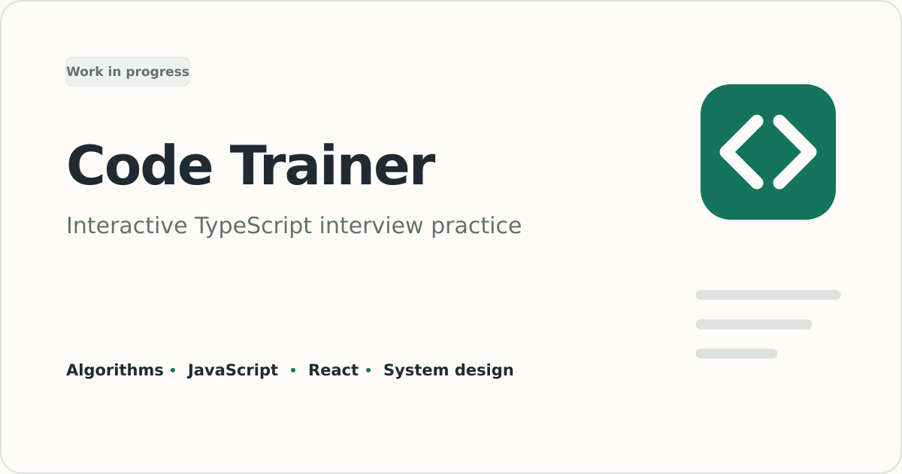

# Code Trainer



Code Trainer is a browser-based interview practice app for intermediate full-stack TypeScript developers. Short MDX lessons lead into coding, debugging, refactoring, React, tracing, written, and system design exercises.

This is a work-in-progress portfolio project. Of the 60 planned lessons, 46 are available and the other 14 are clearly marked "Coming soon." Guest progress works without an account and stays in the current browser. Optional passwordless accounts sync progress across devices through Convex.

## What works today

- A guided curriculum covering algorithms, JavaScript and TypeScript, frontend engineering, backend topics, testing, and system design
- An in-browser Monaco workspace for TypeScript and React exercises
- Automated tests, static checks, and type checks for problems with deterministic answers
- Structured reference and rubric reviews for written and design work
- Local progress, drafts, completion tracking, and a recommended next lesson
- Passwordless email-code accounts with cross-device progress sync
- Responsive navigation, keyboard focus states, and light and dark themes

The exercise runtime stays in the browser. Web Workers isolate code and type-checking work from the interface, while Sucrase and the TypeScript compiler handle submitted code.

## Run it locally

Guest mode needs no external services or environment variables.

```sh
bun install
bun run dev:vite
```

Open [http://localhost:5173](http://localhost:5173).

Use `bun run dev:all` to start Vite and `convex dev` together. Convex uses the selected development deployment, which may be local or cloud. See [DEPLOYMENT.md](DEPLOYMENT.md) for backend variables and deployment setup.

## Useful commands

| Command | Purpose |
| --- | --- |
| `bun run dev:vite` | Start the frontend at `http://localhost:5173` |
| `bun run dev:convex` | Watch backend changes against the selected Convex development deployment |
| `bun run dev:all` | Start Vite and `convex dev` together |
| `bun run test` | Run the Vitest suite |
| `bun run lint` | Run ESLint |
| `bun run build` | Type-check and create the production build |
| `bun run preview` | Serve the production build locally |

## How it is built

- React 19, TypeScript, React Router, and Vite
- Tailwind CSS and shadcn/ui components
- MDX lesson content with a typed curriculum model
- Monaco Editor, Sucrase, TypeScript, and Web Workers for browser-side exercises
- Local storage for guest progress, plus Better Auth and Convex for account sync
- Vitest and ESLint for automated checks

The main project areas are:

| Path | Responsibility |
| --- | --- |
| `src/curriculum` | Lesson content, tracks, problem definitions, and availability |
| `src/components/problems` | Exercise interfaces and grading feedback |
| `src/runtime` | JavaScript, TypeScript, and React execution workers |
| `src/state` | Progress, drafts, recommendations, and sync behavior |
| `convex` | Authenticated progress persistence |

## Work in progress

The next milestones are to finish the remaining lessons and publish the Vercel demo. This repository is intentionally scoped as a portfolio demo rather than a full production service.
